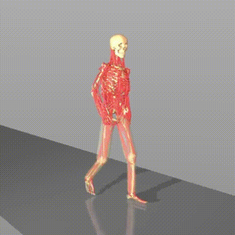
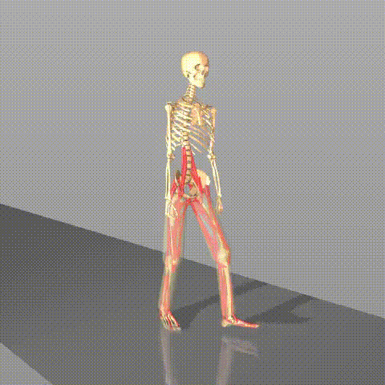
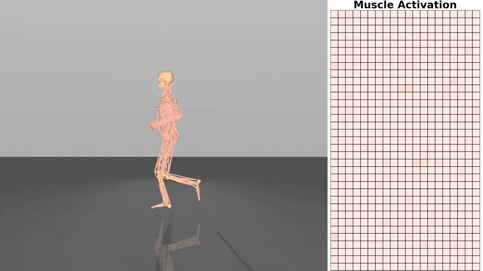
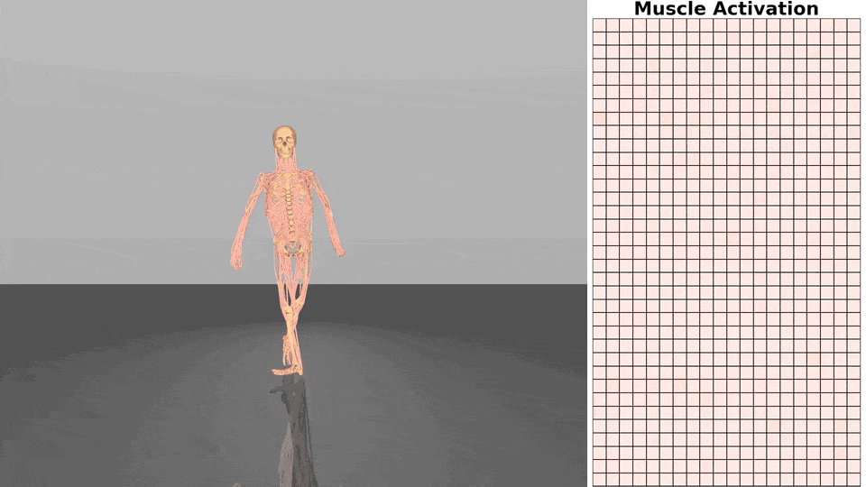

# MS-Human-700: Whole-body Human Musculoskeletal Model

  <a href="https://lnsgroup.cc/research/MS-Human">Project page</a> | <a href="https://github.com/LNSGroup/msgym">Reinforcement Learning Environments (msgym)</a>

  
  

## Overview

This directory contains the **MuJoCo XML** and asset files for the **MS-Human-700** model.

Related papers:
- [MS-Human-700 (ICRA 2024)](https://arxiv.org/abs/2312.05473)
- [DynSyn (ICML 2024)](https://arxiv.org/abs/2407.11472)
- [MPC2 (ICLR 2025)](https://arxiv.org/abs/2505.08238)
- [QFlex (ICLR 2026)](https://arxiv.org/abs/2601.19707)

For reinforcement learning environments and training scripts, see [msgym](https://github.com/LNSGroup/msgym).

To visualize the models, drag-and-drop the `MS-Human-700-*.xml` files into MuJoCo's `simulate` viewer.

## Models

### Primary Model (Full Body)

**File:** `MS-Human-700.xml`

Full body human musculoskeletal model for whole-body locomotion tasks.

* **Bodies:** 90 (optimized to **80**)
* **Joints:** 206 (constrained to **85** for control stability)
* **Muscles:** 700 actuators

### Legs Locomotion Model

**File:** `MS-Human-700-Locomotion.xml`

Focusing on lower-body dynamics. This model isolates the legs for locomotion research while simplifying the upper limbs and torso.

* **Bodies:** 80
* **Joints:** 36
* **Muscles:** 100

### Unimanual Manipulation Model

**File:** `MS-Human-700-Manipulation.xml`

Focusing on right arm and detailed right hand, designed for manipulation tasks.

* **Bodies:** 127
* **Joints:** 42
* **Muscles:** 81

## Control Demo

[DynSyn](https://github.com/Beanpow/DynSyn) control results:

  
  
  

[QFlex](https://lnsgroup.cc/research/Qflex) control results:

  
  

High-Fidelity Motion Tracking (in development) results: 

Leveraging MuJoCo Warp for massively parallel GPU simulation enables the rapid and efficient training of control policies capable of high-precision motion tracking across diverse and dynamic trajectories.

The demos below illustrate these tracking capabilities of the MS-Human model:
*   **Overlap**: The model and reference trajectory are rendered directly to visualize tracking accuracy.
*   **Separate**: The model and reference trajectory are rendered with an offset to showcase motion details.

<table>
  <tr>
    <td align="center" width="25%">
      <video src="https://github.com/user-attachments/assets/f15e68c4-4dbd-4374-90f4-27dd196d57cc" width="100%" controls autoplay loop muted></video>
    </td>
    <td align="center" width="25%">
      <video src="https://github.com/user-attachments/assets/d0961f7a-18c5-49a6-bb24-09b6da265a19" width="100%" controls autoplay loop muted></video>
    </td>
  </tr>
  <tr>
    <td align="center" width="25%">
      <video src="https://github.com/user-attachments/assets/fb996165-4fa3-4182-a17e-aed417e5be65" width="100%" controls autoplay loop muted></video>
    </td>
    <td align="center" width="25%">
      <video src="https://github.com/user-attachments/assets/28e6b539-9763-4cb0-8093-b91c8ac9327c" width="100%" controls autoplay loop muted></video>
    </td>
  </tr>
</table>
